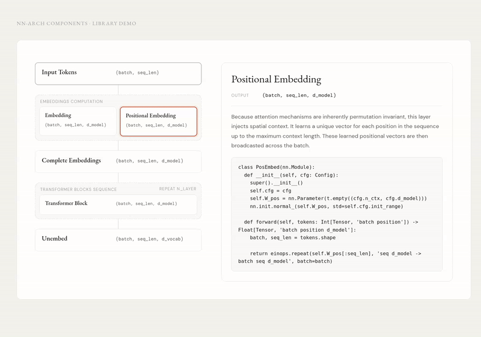

# nn-arch-components

Reusable Lit web components for neural network architecture diagrams.

_This project was vibe coded._

## Project Structure

### Library

- `src/components/nn-layer.js`
- `src/components/nn-layer-group.js`
- `src/components/nn-frame.js`
- `src/index.js` (library entrypoint, exports + registration)
- `src/register.js` (registration-only entrypoint)

### Example

- `examples/nn-arch-components.html` (demo page)
- `examples/styles.css` (demo page styling)
- `examples/demo.gif` (demo preview)

## Demo Preview



## Library Usage

```html
<script type="module" src="./src/register.js"></script>
```

## Component Examples

### `nn-layer`

```html
<nn-layer
  name="Input"
  out_dims="(B, seq_len, model_dim)"
  description="Token embeddings entering the network."
  code="x = embed(tokens)">
</nn-layer>
```

### `nn-layer-group`

```html
<nn-layer-group label="Transformer Blocks" text="Repeat x12" columns="2">
  <nn-layer
    name="Self Attention"
    out_dims="(B, seq_len, model_dim)"
    code="x = self_attn(x)">
  </nn-layer>
  <nn-layer
    name="MLP"
    out_dims="(B, seq_len, ff_dim)"
    code="x = mlp(x)">
  </nn-layer>
</nn-layer-group>
```

### `nn-frame`

```html
<nn-frame total-params="N_layers * model_dim^2" size-label="42 KB" output-dims="1 x 3 x 256 x 256">
  <nn-layer
    name="Input"
    out_dims="(B, seq_dim, model_dim)"
    code="x = embed(tokens)">
  </nn-layer>
  <nn-layer-group label="Blocks" text="Repeat x12" columns="2">
    <nn-layer
      name="Block 1"
      out_dims="(B, seq_dim, model_dim)"
      code="x = self_attn(x)">
    </nn-layer>
    <nn-layer
      name="Block 2"
      out_dims="(B, seq_dim, ff_dim)"
      code="x = mlp(x)">
    </nn-layer>
  </nn-layer-group>
</nn-frame>
```

Use `columns="N"` on `nn-layer-group` to force a side-by-side grid (for example `columns="2"`).
Use `text="..."` on `nn-layer-group` to show optional text in the top-right.

## Imports (optional)

```js
import { NnFrame, NnLayer, NnLayerGroup } from './src/index.js';
```

Importing `src/index.js` auto-registers the custom elements (`nn-frame`, `nn-layer`, `nn-layer-group`).

For the demo page, open `examples/nn-arch-components.html`.
It uses `examples/styles.css` and `../src/register.js`.
If you open the HTML page directly with a `file://` URL, some browsers block local ES module loading; serving the folder over a small local HTTP server avoids that.
